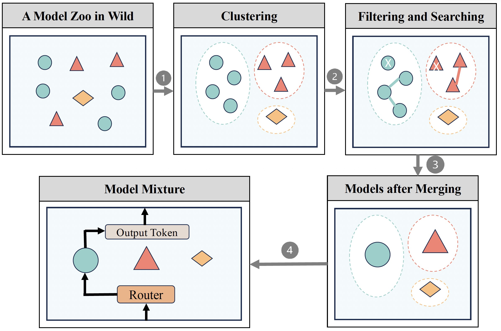

# Model-GLUE: Democratized LLM Scaling for A Large Model Zoo in the Wild

[](https://opensource.org/licenses/MIT)

Code for the paper "**Model-GLUE: Democratized LLM Scaling for A Large Model Zoo in the Wild**".

* Authors: Xinyu Zhao\*, Guoheng Sun\*, Ruisi Cai\*, Yukun Zhou\*, Pingzhi Li\*, Peihao Wang\*, Bowen Tan, Yexiao He, Li Chen, Yi Liang, Beidi Chen, Binhang Yuan, Hongyi Wang$\dag$, Ang Li$\dag$, Zhangyang Wang$\dag$, Tianlong Chen$\dag$
* \* Equal contribution, $\dag$ Equal supervision

## Overview

As Large Language Models (LLMs) excel across tasks and specialized domains, scaling LLMs based on existing models has garnered significant attention, which faces the challenge of decreasing performance when combining disparate models. 
Various techniques have been proposed for the aggregation of pre-trained LLMs, including model merging, Mixture-of-Experts, and stacking. Despite their merits, a comprehensive comparison and synergistic application of them to a diverse model zoo is yet to be adequately addressed.
In light of this research gap, this paper introduces Model-GLUE, a holistic LLM scaling guideline. 
First, our work starts with a benchmarking of existing LLM scaling techniques, especially selective merging, and variants of mixture. 
Utilizing the insights from the benchmark results, we formulate an optimal strategy for the selection and aggregation of a heterogeneous model zoo characterizing different architectures and initialization.
Our methodology involves the clustering of mergeable models and optimal merging strategy selection, and the integration of clusters through a model mixture. Finally, evidenced by our experiments on a diverse Llama-2-based model zoo, \texttt{Model-GLUE} shows an average performance enhancement of 5.61\%, achieved without additional training.




## Setup

1. Setup environment
```shell
conda create -n modelglue python=3.10
conda activate modelglue

pip install -r requirements.txt
```
2. Install lm-eval
```shell
git clone -b offset_by_id https://github.com/s1ghhh/lm-evaluation-harness.git
cd lm-evaluation-harness
pip install --editable ./
```
3. Install bigcode-eval
```shell
git clone https://github.com/bigcode-project/bigcode-evaluation-harness.git
cd bigcode-evaluation-harness && git checkout 00967d1
pip install --editable ./
```